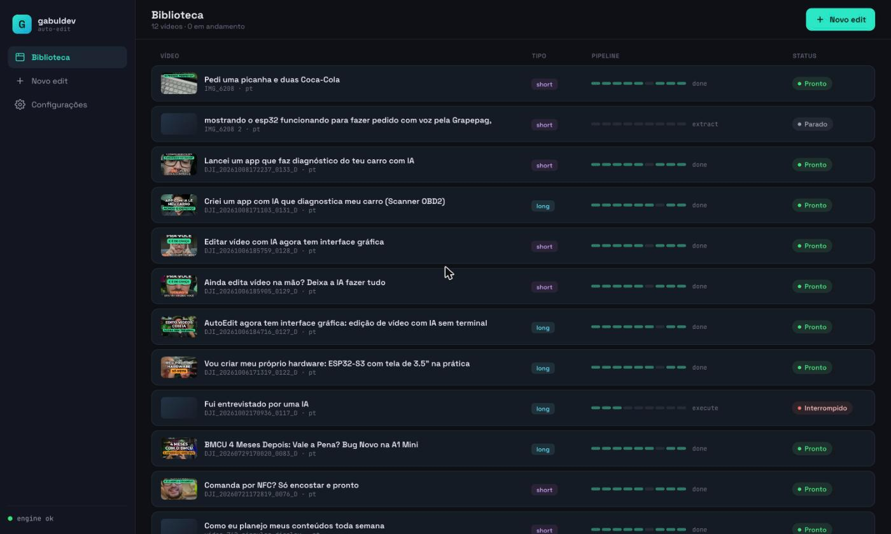
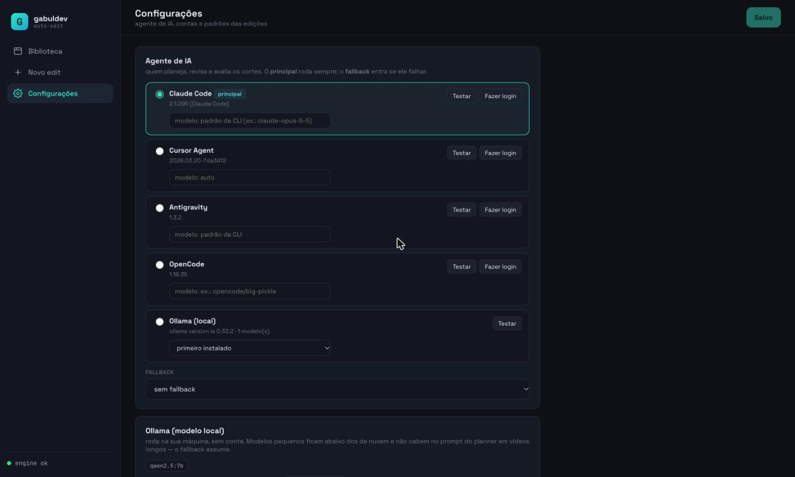
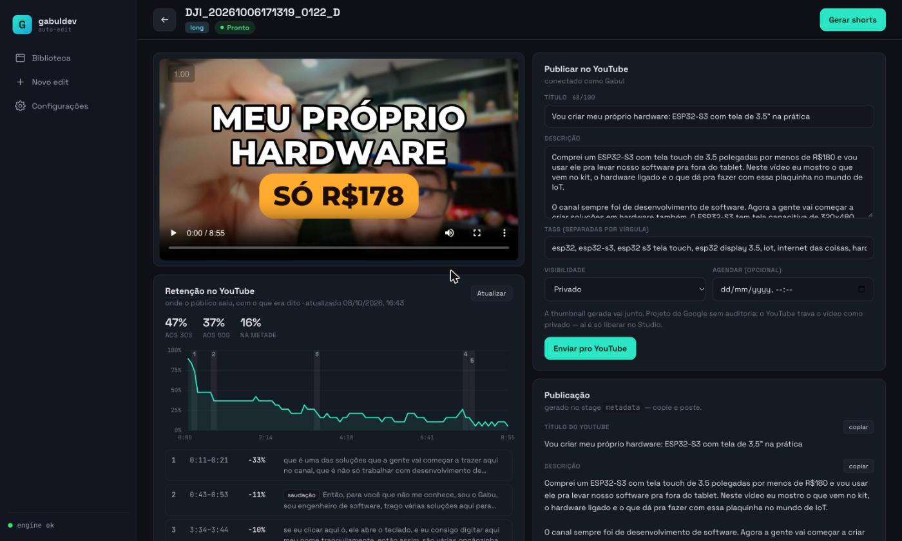
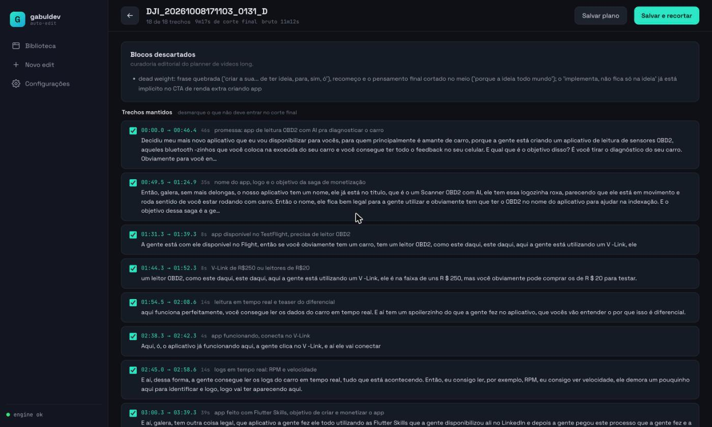
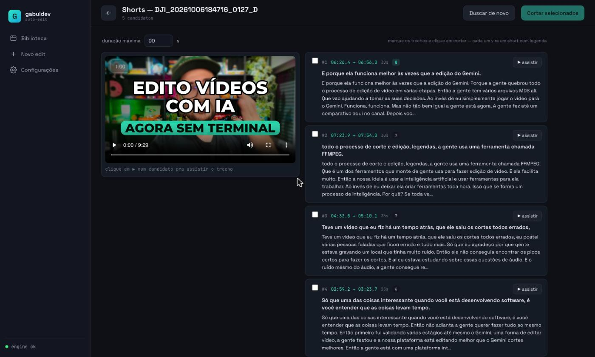

# Auto Edit Video

**Edição de vídeo com IA, do arquivo bruto ao post pronto.** Você escolhe o vídeo, diz do que ele trata, e o Auto Edit transcreve, corta silêncios e enrolação, abre no melhor momento, legenda, gera título/descrição/capítulos/thumbnail e publica no YouTube. Tem **app desktop** (macOS Apple Silicon, Windows, Linux) e **CLI**.



## Baixar o app

Baixe o instalador do seu sistema na **[página de Releases](https://github.com/gabuldev/auto-edit-video/releases/latest)**:

| Sistema | Arquivo |
|---------|---------|
| macOS (Apple Silicon) | `Auto-Edit_<versão>_aarch64.dmg` |
| Windows | `Auto-Edit_<versão>_x64-setup.exe` (ou `_x64_en-US.msi`) |
| Linux | `.deb` (Ubuntu/Debian) ou `.rpm` (Fedora) |

Mac com processador Intel não tem instalador (as bibliotecas de IA pararam de publicar pacotes pra ele) — use o [CLI](#usar-pelo-terminal-cli).

O app já vem com tudo que o pipeline precisa (Python, Whisper e um FFmpeg com legenda) — **não precisa instalar Python nem FFmpeg**. O que você instala é **um agente de IA** (veja abaixo).

**Primeira abertura** — os instaladores ainda não são assinados, então o sistema avisa:

- **macOS**: "Auto-Edit está danificado" ou "não pode ser aberto" → clique com o botão direito no app → **Abrir**. Se ainda reclamar: `xattr -cr /Applications/Auto-Edit.app`.
- **Windows**: "O Windows protegeu o computador" → **Mais informações** → **Executar assim mesmo**. O pipeline usa `bash`: instale o [Git for Windows](https://git-scm.com/download/win).
- **Linux**: `sudo apt install ./Auto-Edit_*_amd64.deb` (ou `sudo dnf install ./Auto-Edit-*.x86_64.rpm`).

### O agente de IA

Quem planeja, revisa e avalia os cortes é um agente de linha de comando que você instala e loga uma vez. Em **Configurações** o app mostra quais estão instalados, testa cada um com um prompt de verdade e abre o login:

| Agente | Instalar |
|--------|----------|
| **Claude Code** (padrão) | [docs.claude.com](https://docs.claude.com/en/docs/claude-code) |
| **Cursor Agent** | [cursor.com/docs/cli](https://cursor.com/docs/cli) |
| **Antigravity** (`agy`) | [antigravity.google](https://antigravity.google) |
| **OpenCode** | [opencode.ai](https://opencode.ai) |
| **Ollama** (modelo local, sem conta) | [ollama.com](https://ollama.com) — bom pra shorts; em vídeos longos o prompt não cabe num modelo local e o fallback assume |



## O que ele faz

- **Corta** silêncios, falsas largadas, repetições e, em vídeos longos, blocos inteiros que não entregam nada.
- **Abertura que segura**: a promessa do vídeo nos primeiros ~15s, e um **cold open** com o melhor momento antes da abertura. Quando ajuda, **reordena** os blocos (a demo antes da explicação).
- **Avalia antes de renderizar**: um agente revisa o corte planejado e devolve pro plano se a abertura enrola ou uma frase fica cortada — o FFmpeg só corta depois de aprovado.
- **Legendas** estilo CapCut nos shorts e `.srt` nos longs.
- **Título, descrição, tags, capítulos, comentário pra fixar e thumbnail**.
- **Shorts a partir de um long**: o agente sugere trechos que se sustentam sozinhos; você assiste cada um e corta os que quiser.
- **Publica no YouTube** (com legenda e agendamento) e mostra **onde o público saiu** na curva de retenção, com o que você estava falando naquele momento — e o planner aprende com isso nos próximos vídeos.



| Revisar cortes | Shorts de um long |
|---|---|
|  |  |

## Como funciona

O pipeline é uma state machine orquestrada por agentes de IA e ferramentas FFmpeg:

```
extract → plan → review → evaluate → execute → overlay → caption → metadata → thumbnail
Whisper   agente  agente   agente     FFmpeg    FFmpeg    FFmpeg    agente     Python
```

| Stage | O que faz |
|-------|-----------|
| **extract** | Transcreve o áudio (Whisper) e mede a energia do áudio |
| **plan** | Planeja os cortes; no long, faz curadoria editorial e cuida da abertura |
| **review** | Revisa o plano (cortes faltando, frases quebradas) |
| **evaluate** | Cold open/reordenação, e julga o **corte planejado** antes de renderizar — rejeita e volta pro plan (até 3x) |
| **execute** | Corta o vídeo via FFmpeg, com normalização de áudio |
| **overlay** | Overlays gráficos com chroma key (só long) |
| **caption** | Legendas estilo CapCut (só short) |
| **metadata** | Título, descrição, tags, capítulos e comentário pra fixar |
| **thumbnail** | Escolhe o frame e monta a thumbnail |

## Usar pelo terminal (CLI)

Tudo que o app faz também roda pelo `auto-edit`. A instalação abaixo é só pra usar o CLI (ou desenvolver) — quem usa o app não precisa dela.

### Instalação

#### Opção 1 — Nix (recomendada, zero dependências manuais)

Nix instala Python, FFmpeg e todas as deps automaticamente. Nada precisa estar pré-instalado.

```bash
# Instalar Nix (uma vez, se ainda não tiver)
curl --proto '=https' --tlsv1.2 -sSf -L https://install.determinate.systems/nix | sh -s -- install

# Instalar auto-edit (com tudo incluso)
nix profile install github:gabuldev/auto-edit-video
```

Na primeira execução, o auto-edit cria um venv e instala as deps Python (~2 GB com PyTorch). Depois disso, executa instantaneamente.

Ou rode sem instalar:

```bash
nix run github:gabuldev/auto-edit-video -- short video.mp4 --context "..."
```

#### Opção 2 — curl | bash (instala deps do sistema automaticamente)

```bash
curl -sSL https://raw.githubusercontent.com/gabuldev/auto-edit-video/main/install.sh | bash
```

O script detecta e instala automaticamente o que falta (Python, FFmpeg, git) via Homebrew (macOS), apt, dnf ou pacman (Linux). Instala o `auto-edit` em `~/.auto-edit-video/`.

#### Pós-instalação

```bash
auto-edit doctor    # valida o setup
auto-edit update    # atualiza para última versão
```

Para desinstalar:

```bash
# Nix
nix profile remove auto-edit-video

# curl | bash
bash ~/.auto-edit-video/uninstall.sh
```

#### Dependência opcional

- **[Claude Code](https://docs.anthropic.com/en/docs/claude-code)** — `npm install -g @anthropic-ai/claude-code` (necessário para stages de IA)

#### Desenvolvimento (Nix)

Para contribuidores:

```bash
git clone https://github.com/gabuldev/auto-edit-video.git
cd auto-edit-video
nix develop  # ou: make setup
```

## Uso

### Editar um short (vertical, com legendas)

```bash
auto-edit short upload/meu-video.mp4 \
  --context "Review de produto tech, tom casual" \
  --whisper-model small
```

### Editar long-form (horizontal, com overlays, sem legendas)

```bash
auto-edit long upload/meu-video.mp4 \
  --context "Tutorial de programação em Python"
```

### Batch (processar vários vídeos)

```bash
auto-edit batch upload/pasta-de-videos/ --type short \
  --context "Vlogs de viagem, energia alta"
```

### Merge (concatenar + editar)

```bash
auto-edit merge upload/clips/ --name video-final --type long \
  --context "Compilação de dicas de produtividade"
```

### Retomar de um stage específico

```bash
auto-edit resume upload/meu-video.mp4 --from plan
auto-edit resume upload/meu-video.mp4 --from extract --whisper-model medium
```

### Ver status do pipeline

```bash
auto-edit status upload/meu-video.mp4
```

## Planejamento de conteúdo (`auto-edit plan`)

Além de editar, o auto-edit ajuda a **planejar** o que tu vai postar. Plans semanais ou mensais geram tópicos (longs + shorts), datas de gravação/publicação e talking points — usando IA + um perfil livre que tu escreve sobre teu canal.

O fluxo fecha o loop entre **planejamento → gravação → edição**: cada vídeo editado é vinculado a um slot do plano, e o `status` cruza isso com as datas pra dizer o que tá pronto, atrasado ou pendente.

### Setup (uma vez)

```bash
# Criar diretório e templates
auto-edit plan path

# Editar teu perfil (texto livre — o planner usa como contexto)
$EDITOR ~/.auto-edit/profile/identity.md
$EDITOR ~/.auto-edit/profile/channel_history.md

# (Opcional) apontar pra pasta onde tu joga as gravações
export AUTO_EDIT_INBOX="/Volumes/XPG/Movies/precisa-editar"
```

### Gerar um plano

```bash
# Plano semanal (3 longs + 6 shorts por padrão)
auto-edit plan new -w next \
  -c "essa semana: foco em IA + 3D" \
  -s "long sobre auto-edit pipeline; setup Bambulab"

# Plano mensal (12 + 24)
auto-edit plan new -m next -c "..." -s "..."

# Atalhos
auto-edit plan new -w current      # semana atual
auto-edit plan new -m 2026-06      # mês explícito
```

### Ver, editar, listar

```bash
auto-edit plan show               # default: semana atual
auto-edit plan show -w 2026-W19   # semana específica
auto-edit plan edit               # abre yaml no $EDITOR
auto-edit plan list               # todos os plans existentes
```

### Vincular vídeos ao plano (ingest)

```bash
# Lista slots pendentes, tu escolhe um, depois escolhe a pasta
auto-edit plan ingest

# Auto-pareia pastas nomeadas como 2026-W19_S2_xxx ou
# que casam com o `source_folder` do yaml; o resto cai no interativo
auto-edit plan ingest --run    # já edita tudo no fim
```

### Acompanhar progresso

```bash
auto-edit plan status            # default: semana atual
auto-edit plan status --all      # todos os plans
```

| Status | Quando |
|---|---|
| `planned` | Nenhum workspace existe vinculado ao slot |
| `recorded` | Workspace existe, pipeline em andamento |
| `edited` | Pipeline terminou |
| `published` | Tu marcou manualmente no yaml |
| ⚠ late | `publish_at < hoje` E ainda não foi editado |

### Loop bidirecional (inbox → planner)

Se `$AUTO_EDIT_INBOX` aponta pra uma pasta com subpastas de gravações, o `plan new` lê os nomes dessas subpastas e o planner sugere slots que **cobrem o que tu já filmou** — em vez de inventar tópicos do zero. Cada slot ganha um campo `source_folder` que o `ingest` usa pra parear automaticamente sem renomear.

### Onde mora tudo

```
~/.auto-edit/                       # sobrescrito por $AUTO_EDIT_HOME
├── profile/                        # markdowns livres lidos pelo planner
│   ├── identity.md
│   ├── channel_history.md
│   └── ... (qualquer .md vai como contexto)
└── plans/
    ├── 2026-W19.yaml
    └── 2026-06.yaml
```

Plans ficam fora do repo opensource — dado pessoal.

### Vincular um vídeo direto (sem ingest)

```bash
auto-edit short video.mp4 --plan-id S2     # forma curta (se único)
auto-edit short video.mp4 --plan-id 2026-W19/S2
auto-edit merge folder/ --type long --plan-id L1
```

Sem `--plan-id`, se houver slots pendentes, a CLI pergunta interativamente. Use `--no-plan-prompt` pra desligar o prompt.

## Claude Code Extension

### MCP Server (recomendado)

O auto-edit-video funciona como extensão do Claude Code via MCP. Adicione ao seu `~/.claude.json` ou `.claude/settings.json`:

```json
{
  "mcpServers": {
    "auto-edit-video": {
      "command": "auto-edit",
      "args": ["mcp-server"]
    }
  }
}
```

Requer a dependência MCP: `pip install auto-edit-video[mcp]`

Depois disso, o Claude Code ganha acesso direto a tools como `edit_short`, `edit_long`, `pipeline_status`, `resume_pipeline` e `doctor`. Basta conversar normalmente:

> "Edita o vídeo video.mp4 como short, contexto é review de produto tech"

### Slash Commands

O projeto também inclui slash commands para usar dentro do Claude Code (quando estiver no diretório do projeto):

| Comando | O que faz |
|---------|-----------|
| `/edit-video` | Guia interativo para iniciar uma edição |
| `/edit-status` | Dashboard de todos os pipelines ativos |
| `/edit-preview` | Preview textual do que vai ser cortado |
| `/review-cuts` | Aprovar/editar o cut plan antes de executar |
| `/fix-stage` | Diagnostica e corrige um stage com falha |

## Opções

### Modelo Whisper

| Modelo | Velocidade | Precisão | Uso |
|--------|-----------|----------|-----|
| `tiny` | Muito rápido | Básica | Áudio limpo, fala clara |
| `base` | Rápido | Boa | Testes rápidos |
| **`small`** | **Moderado** | **Muito boa** | **Recomendado (default)** |
| `medium` | Lento | Excelente | Áudio ruidoso, múltiplos falantes |
| `large` | Muito lento | Máxima | Quando precisão é crítica |

### Legendas (shorts)

```bash
auto-edit short video.mp4 \
  --highlight-color "&H0045FF&"  # cor ASS (BBGGRR) — padrão: laranja
  --highlight-border 2.5         # espessura do destaque
  --font-size 14                 # tamanho da fonte
```

### LLM Backend

```bash
# Usar Claude (default)
auto-edit short video.mp4

# Outro agente: claude, cursor, agy (Antigravity), opencode ou ollama (local)
auto-edit short video.mp4 --cli agy --cli-fallback claude

# Modelo de cada agente
export AUTO_EDIT_OPENCODE_MODEL=opencode/big-pickle
export AUTO_EDIT_OLLAMA_MODEL=qwen2.5:7b

# Via variáveis de ambiente
export AUTO_EDIT_LLM=claude
export AUTO_EDIT_LLM_FALLBACK=cursor
export AUTO_EDIT_LLM_TIMEOUT=600  # timeout em segundos (default: 10min)
```

O padrão também pode ficar salvo em `~/.auto-edit/settings.json` (é o que a tela de **Configurações** do app grava). Variáveis de ambiente e flags têm prioridade.

## Arquitetura

```
auto-edit-video/
├── auto_edit/              # Core do pipeline
│   ├── cli.py              # CLI (Typer) — comandos de edição
│   ├── pipeline.py         # State machine (9 stages)
│   ├── plan.py             # Subcomando `plan` (planejamento de conteúdo)
│   ├── config.py           # Paths de ~/.auto-edit/
│   ├── runner.py           # Builder de prompts + invocação LLM
│   └── workspace.py        # Gestão de workspaces
├── agents/                 # Prompts dos agentes LLM (markdown)
│   ├── planner.md          # Regras de planejamento de cortes
│   ├── reviewer.md         # Regras de QA dos cortes
│   ├── evaluator.md        # Regras de avaliação de qualidade
│   ├── overlayer.md        # Regras de posicionamento de overlays
│   ├── metadata.md         # Regras de geração de metadados
│   └── plan_month.md       # Regras de planejamento mensal/semanal
├── tools/                  # Ferramentas Python (FFmpeg/Whisper)
│   ├── extract.py          # Transcrição + energia + correção IA
│   ├── executor.py         # Cortes FFmpeg + loudnorm
│   ├── captioner.py        # Legendas ASS + burn FFmpeg
│   └── overlayer.py        # Composição de overlays + chroma key
├── ralph.sh                # Loop engine (orquestra stages)
├── tests/                  # Test suite (pytest)
├── .claude/commands/       # Claude Code skills
├── workspace/              # Workspaces por vídeo (auto-gerados)
└── output/                 # Vídeos finalizados
```

### Fluxo de dados por stage

```
upload/video.mp4
  → workspace/video/
      transcription.json      ← extract (Whisper + energia + correção Claude)
      cut_plan.json            ← plan (agente LLM)
      reviewed_plan.json       ← review (agente LLM)
      edited_video.mp4         ← execute (FFmpeg trim + concat + loudnorm)
      overlaid_video.mp4       ← overlay (FFmpeg chroma key) [long only]
      captions.ass             ← caption (ASS gerado)
      captioned_video.mp4      ← caption (FFmpeg subtitles burn) [short only]
      post_cut_transcription.json ← caption (timestamps remapeados)
      assessment.json          ← evaluate (agente LLM)
      metadata.json            ← metadata (agente LLM)
  → output/video_final.mp4    ← done (cópia + cleanup)
  → output/video.txt          ← done (título + descrição + hashtags)
```

## Funcionalidades técnicas

- **Codec fallback**: `h264_videotoolbox` → `libx264` → `libx265` (cross-platform)
- **Normalização de áudio**: EBU R128 (`loudnorm`) após cortes para volume consistente
- **Validação de cut plans**: Verifica bounds antes do FFmpeg; rejeita intervalos sub-frame
- **Correção de transcrição com IA**: Claude revisa output do Whisper (corrige alucinações, termos técnicos)
- **Timestamps remapeados**: Captioner reutiliza transcrição original sem re-rodar Whisper
- **Timeout em chamadas LLM**: Configurável via `AUTO_EDIT_LLM_TIMEOUT` (default: 600s)
- **Persistência de erros**: Falhas salvas no `pipeline.json` com mensagem de erro
- **Progresso em tempo real**: Output dos tools Python e FFmpeg visível durante execução

## Testes

```bash
pip install -e ".[test]"
python -m pytest tests/ -v
```

## Licença

Este projeto é **source available** sob a
[PolyForm Noncommercial License 1.0.0](LICENSE) — não é uma licença open source
no sentido da OSI, porque restringe o uso comercial.

**O que você pode fazer (grátis):**

- ✅ Usar, estudar e modificar o código para **fins não-comerciais**
- ✅ Uso pessoal, hobby, pesquisa, educação e organizações sem fins lucrativos
- ✅ Redistribuir com suas mudanças (mantendo esta licença e os avisos de copyright)

**O que requer licença comercial paga:**

- 💼 Qualquer uso com finalidade comercial (produtos, serviços, uso em empresa
  com fins lucrativos)
- 💼 Oferecer o `auto-edit-video` — ou um derivado — como serviço/produto pago

### Versão hosted & licença comercial

A **versão hospedada (SaaS) é um produto pago oficial e exclusivo** do
mantenedor. Se você precisa usar o projeto comercialmente ou quer a versão
hosted, entre em contato para adquirir uma licença comercial:

📧 **contato@gabul.dev**

> Modelo de *dual licensing*: o código fica público sob a PolyForm Noncommercial
> para a comunidade, enquanto o mantenedor (Gabriel Sampaio / gabuldev) oferece
> licenças comerciais e a versão hosted paga à parte. Veja
> [`CONTRIBUTING.md`](CONTRIBUTING.md) para os termos de contribuição.
